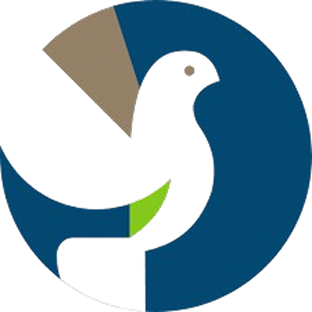

<p align="center">
  
</p>

<h1 align="center">Auth Starter Kit - Mobile Client</h1>

<p align="center">
  <strong>Flutter mobile application with modern authentication system</strong>
</p>

<p align="center">
  
  
  
  
</p>

---

## 📱 Tentang Aplikasi

**Auth Starter Kit Client** adalah aplikasi mobile Flutter yang menyediakan sistem autentikasi modern dengan fitur login, logout, dan manajemen token yang aman. Aplikasi ini menggunakan arsitektur BLoC (Business Logic Component) untuk state management yang terstruktur dan mudah di-maintain.

### ✨ Fitur Utama

- 🔐 **Autentikasi Aman** - Login dengan email dan password
- 📱 **Device Tracking** - Otomatis mencatat informasi device
- 🔒 **Secure Token Storage** - Token disimpan dengan enkripsi menggunakan FlutterSecureStorage
- 🎨 **Modern UI/UX** - Desain yang clean dan responsif
- 🔄 **State Management** - Menggunakan BLoC pattern untuk state management
- 🚪 **Logout Confirmation** - Dialog konfirmasi sebelum logout
- 📊 **Loading States** - Indikator loading yang jelas untuk setiap aksi
- ⚡ **Fast & Responsive** - Performa optimal dengan Flutter

---

## 🏗️ Arsitektur

Aplikasi ini menggunakan arsitektur **BLoC Pattern** dengan struktur folder yang terorganisir:

```
client/lib/
├── blocs/
│   ├── login/              # Login BLoC
│   │   ├── login_bloc.dart
│   │   ├── login_event.dart
│   │   └── login_state.dart
│   └── logout/             # Logout BLoC
│       ├── logout_bloc.dart
│       ├── logout_event.dart
│       └── logout_state.dart
├── repositories/
│   └── auth_repository.dart    # API communication layer
├── shared/
│   └── themes.dart             # App theme & styling
├── ui/
│   └── pages/
│       ├── login_page.dart     # Login screen
│       └── home_page.dart      # Home screen
└── main.dart                   # App entry point
```

---

## 🚀 Instalasi & Setup

### Prasyarat

Pastikan Anda sudah menginstall:

- Flutter SDK (3.10.7 atau lebih baru)
- Dart SDK (3.10.7 atau lebih baru)
- Android Studio / Xcode (untuk emulator)
- Git

### Langkah Instalasi

1. **Clone repository**

   ```bash
   git clone <repository-url>
   cd auth-starter-kit/client
   ```

2. **Install dependencies**

   ```bash
   flutter pub get
   ```

3. **Konfigurasi Backend URL**

   Edit file `lib/repositories/auth_repository.dart` dan sesuaikan `baseUrl`:

   ```dart
   // Untuk Android Emulator
   final String baseUrl = 'http://10.0.2.2:8000/api';

   // Untuk iOS Simulator
   final String baseUrl = 'http://127.0.0.1:8000/api';

   // Untuk Physical Device (ganti dengan IP laptop Anda)
   final String baseUrl = 'http://192.168.x.x:8000/api';
   ```

4. **Jalankan aplikasi**

   ```bash
   # Untuk debug mode
   flutter run

   # Untuk release mode
   flutter run --release
   ```

---

## 📦 Dependencies

| Package                  | Version | Fungsi                               |
| ------------------------ | ------- | ------------------------------------ |
| `flutter_bloc`           | ^9.1.1  | State management dengan BLoC pattern |
| `equatable`              | ^2.0.8  | Membandingkan objek dengan mudah     |
| `http`                   | ^1.6.0  | HTTP client untuk API calls          |
| `device_info_plus`       | ^12.3.0 | Mendapatkan informasi device         |
| `uuid`                   | ^4.5.2  | Generate unique identifiers          |
| `flutter_secure_storage` | ^10.0.0 | Penyimpanan token yang aman          |
| `google_fonts`           | ^8.0.1  | Custom fonts dari Google             |
| `flutter_screenutil`     | ^5.9.3  | Responsive UI                        |
| `overlay_support`        | ^2.1.0  | Toast & overlay notifications        |

---

## 🔐 Fitur Autentikasi

### Login Flow

1. User memasukkan **email** dan **password**
2. Klik tombol **"Sign In"**
3. Aplikasi mengumpulkan informasi device:
   - Device name
   - Operating system
   - Unique device identifier
4. Request dikirim ke backend API `/api/login`
5. Jika berhasil:
   - ✅ Token disimpan di secure storage
   - ✅ Redirect ke home page
   - ✅ Tampilkan success notification
6. Jika gagal:
   - ❌ Tampilkan error message
   - ❌ User tetap di login page

### Logout Flow

1. User klik **FAB (Floating Action Button)** di home page
2. Menu expand menampilkan opsi **"Logout"**
3. Klik "Logout" → muncul **confirmation dialog**
4. Konfirmasi logout:
   - 🔄 Loading state ditampilkan
   - 📡 Request ke backend API `/api/logout`
   - 🗑️ Token dihapus dari server (revoke)
   - 🔒 Token dihapus dari local storage
   - 🏠 Redirect ke login page
5. **Fallback**: Jika API gagal, tetap logout secara lokal

---

## 🛡️ Keamanan

- ✅ **Encrypted Storage** - Token disimpan dengan enkripsi di Keychain (iOS) / Keystore (Android)
- ✅ **Token Revocation** - Token dihapus dari server saat logout
- ✅ **Secure Communication** - Menggunakan HTTPS untuk production
- ✅ **Device Tracking** - Setiap login tercatat dengan informasi device
- ✅ **Auto Logout** - Token expired otomatis logout

---

## 🧪 Testing

### Manual Testing

1. **Jalankan backend server** (Laravel)

   ```bash
   cd ../admin
   php artisan serve --host=0.0.0.0
   ```

2. **Jalankan Flutter app**

   ```bash
   flutter run
   ```

3. **Test Login**
   - Gunakan credentials user yang sudah terdaftar
   - Pastikan berhasil redirect ke home page

4. **Test Logout**
   - Klik FAB di home page
   - Konfirmasi logout
   - Pastikan redirect ke login page

### Unit Testing

```bash
flutter test
```

---

## 🔧 Troubleshooting

### ❌ Connection Refused

**Android Emulator:**

- Gunakan `http://10.0.2.2:8000/api` sebagai baseUrl
- Pastikan Laravel serve berjalan

**iOS Simulator:**

- Gunakan `http://127.0.0.1:8000/api`

**Physical Device:**

- Pastikan laptop dan HP di WiFi yang sama
- Laravel serve dengan `--host=0.0.0.0`
- Gunakan IP laptop sebagai baseUrl (cek dengan `ipconfig getifaddr en0` di Mac)

### ❌ Token Not Found

- Pastikan login berhasil terlebih dahulu
- Cek secure storage dengan debug mode
- Clear app data dan login ulang

### ❌ API 401 Unauthorized

- Pastikan token masih valid
- Cek apakah route menggunakan middleware `auth:sanctum`
- Logout dan login ulang

---

## 📱 Platform Support

| Platform | Status         | Min Version       |
| -------- | -------------- | ----------------- |
| Android  | ✅ Supported   | API 21 (Lollipop) |
| iOS      | ✅ Supported   | iOS 12.0          |
| Web      | 🚧 Coming Soon | -                 |
| macOS    | 🚧 Coming Soon | -                 |
| Windows  | 🚧 Coming Soon | -                 |
| Linux    | 🚧 Coming Soon | -                 |

---

## 📄 License

This project is licensed under the MIT License.

---

## 👨‍💻 Developer

Developed with ❤️ using Flutter

---

## 📞 Support

Jika Anda mengalami masalah atau memiliki pertanyaan, silakan:

- 📧 Buat issue di repository
- 📖 Baca dokumentasi lengkap di `IMPLEMENTATION_DOCS.md`
- 💬 Hubungi tim developer

---

<p align="center">
  <strong>Happy Coding! 🚀</strong>
</p>
